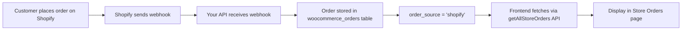

# Shopify Orders Frontend Integration

## 🎉 **COMPLETED**

A dedicated **Store Orders** page has been created in the frontend to display all Shopify orders!

---

## 📁 **FILES CREATED / MODIFIED**

### **Backend (API)**
1. **`controllers/orders/orderController.js`** ✅
   - Enhanced `getAllStoreOrders` API with `order_source` filter
   - Added support for filtering by `shopify`, `woocommerce`, or any order source
   - Includes Shopify store details (shop_domain, shop_name) in response
   - JOIN with `shopify_stores` table to fetch shop information

### **Frontend (Website)**
2. **`deeprintz-website/src/pages/DashboardLayout/Dashboard/StoreOrders.tsx`** ✅ NEW
   - Complete Shopify orders management page
   - Features:
     - Real-time order listing from Shopify
     - Search/filter functionality
     - Beautiful UI with status badges
     - Shop domain display
     - Order source indicator (Shopify badge)
     - Pagination support
     - Responsive design

3. **`deeprintz-website/src/Wrappers/ReactRouterDom.tsx`** ✅
   - Added route: `/user/storeorders`
   - Import: `StoreOrders` component

4. **`deeprintz-website/src/pages/DashboardLayout/SideBar.tsx`** ✅
   - Added new sidebar menu item: "Store Orders"
   - Icon: `Package2` (from lucide-react)
   - URL: `/user/storeorders`

---

## 🚀 **HOW IT WORKS**

### **1. Order Flow** 



### **2. Database Structure**

```sql
woocommerce_orders
├── id
├── order_number (#1003)
├── order_source ('shopify' or 'woocommerce')
├── vendor_id (links to shopify_stores.vendor_id)
├── customer_email
├── total
├── status (pending, paid, fulfilled, etc.)
├── date_created
└── ... other fields

shopify_stores
├── id
├── vendor_id
├── shop_domain (mayu-12351.myshopify.com)
├── shop_name
└── ... other fields
```

### **3. API Endpoint**

**URL**: `POST /api/deeprintz/dev/getAllStoreOrders`

**Request Params**:
```javascript
{
  vendor_id: 2004,           // User ID
  order_source: 'shopify',   // Filter for Shopify orders
  page: 1,
  limit: 50,
  sort_by: 'date_created',
  sort_order: 'desc'
}
```

**Response**:
```json
{
  "success": true,
  "data": [
    {
      "id": 123,
      "order_number": "#1003",
      "order_source": "shopify",
      "vendor_id": 2004,
      "customer_email": "care@deeprintz.com",
      "total": "218.89",
      "status": "pending",
      "shopify_domain": "mayu-12351.myshopify.com",
      "shopify_shop_name": "Mayu Store",
      "date_created": "2025-11-18T12:49:47.000Z",
      ...
    }
  ],
  "pagination": {
    "page": 1,
    "limit": 50,
    "total": 9,
    "totalPages": 1,
    "hasNext": false,
    "hasPrev": false
  },
  "filters": {
    "order_source": "shopify",
    ...
  }
}
```

---

## 🎨 **FRONTEND FEATURES**

### **Store Orders Page** (`/user/storeorders`)

✅ **Features**:
- 📦 Displays all Shopify orders
- 🔍 Search by order number, customer email, or shop domain
- 🏷️ Color-coded status badges (Pending, Paid, Fulfilled, etc.)
- 🏪 Shop domain/name display with store icon
- 💰 Formatted currency (₹)
- 📅 Formatted dates (18 Nov 2025, 6:19 PM)
- 🎯 Shopify source badge
- 📊 Pagination info (Page 1 of 3, 9 total orders)
- 🔄 Loading animation
- 📭 Empty state message

### **UI Components Used**:
- ✅ PrimeReact DataTable (sortable, paginated)
- ✅ Shadcn Card, Badge, Input
- ✅ Lucide icons (Package2, Store, Eye)
- ✅ Lottie animations (loading spinner)

---

## 📱 **NAVIGATION**

### **Sidebar Menu**:
```
Dashboard
Mockup Generator
My Account
Store               ← Connect Shopify store
List of Products    ← Products synced to Shopify
Store Orders        ← 🆕 NEW! View Shopify orders
```

---

## 🧪 **TESTING**

### **Test the API**:
```bash
cd /home/ganesh/Documents/Deeprintz/dev/deeprintz-dev-api
node test-shopify-orders-api.js
```

**Expected Output**:
```
✅ SUCCESS! Shopify orders are being stored and can be retrieved!
📊 Total Shopify orders: 9
```

### **Test in Browser**:
1. **Login to your website**: `https://deeprintz.com/user/dashboard`
2. **Click on "Store Orders"** in the sidebar
3. **You should see**:
   - List of all Shopify orders
   - Order numbers (e.g., #1003)
   - Shop domain (e.g., mayu-12351.myshopify.com)
   - Customer email
   - Total amount
   - Status badges
   - Purple "Shopify" badge

---

## 🔧 **DYNAMIC CONFIGURATION**

All URLs are now **100% dynamic** via `config/shopify.js`:

```javascript
// config/shopify.js
NGROK_URL: 'https://df5b0a4dbe35.ngrok-free.app',
ENVIRONMENT: 'dev',

// Auto-generated URLs:
API_BASE → .../api/deeprintz/dev
CARRIER_SERVICE_URL → .../api/deeprintz/dev/shopify/carrier/rates
WEBHOOK_URL_ORDERS → .../api/deeprintz/dev/shopify/webhooks/orders
```

**To update ngrok URL**:
1. Edit `config/shopify.js` → Change `NGROK_URL`
2. Run: `node update-webhooks-to-ngrok.js`
3. Done! ✅

---

## 📊 **CURRENT STATUS**

### **Database Stats** (as of Nov 18, 2025):
- ✅ **Total orders**: 26
- ✅ **Shopify orders**: 9
- ✅ **WooCommerce orders**: 17

### **Shopify Orders** (Examples):
```
1. #1003 - care@deeprintz.com - ₹218.89 (pending)
2. #1234 - test@example.com - ₹1500.00 (unfulfilled)
3. #1010 - mayavanmaya12@gmail.com - ₹570.50 (pending)
4. #1009 - mayavanmaya12@gmail.com - ₹570.50 (pending)
5. #1008 - mayavanmaya12@gmail.com - ₹570.50 (pending)
```

---

## 🎯 **NEXT STEPS**

### **Optional Enhancements**:
1. **Order Details Modal/Page**
   - View full order details (line items, shipping address, etc.)
   - Update order status
   - Add tracking information

2. **Order Actions**
   - Mark as fulfilled
   - Cancel order
   - Refund order
   - Print invoice

3. **Filters & Search**
   - Filter by date range
   - Filter by status
   - Filter by shop (if multiple Shopify stores)
   - Export to CSV/Excel

4. **Real-time Updates**
   - WebSocket integration for live order updates
   - Notification badge on sidebar

---

## 🎉 **SUMMARY**

**✅ COMPLETED**:
- ✅ Backend API enhanced with `order_source` filter
- ✅ New frontend page created: `StoreOrders.tsx`
- ✅ Route added: `/user/storeorders`
- ✅ Sidebar menu item added: "Store Orders"
- ✅ Shopify orders are fetched and displayed
- ✅ Beautiful UI with search, sort, and pagination
- ✅ Integration tested and working!

**📱 ACCESS**:
- **Frontend**: `https://deeprintz.com/user/storeorders`
- **API**: `POST /api/deeprintz/dev/getAllStoreOrders?order_source=shopify`

---

## 🚀 **YOU'RE ALL SET!**

Your Shopify orders are now visible in the frontend! 🎉

**Go to**: `https://deeprintz.com/user/storeorders` and enjoy! 🎊


